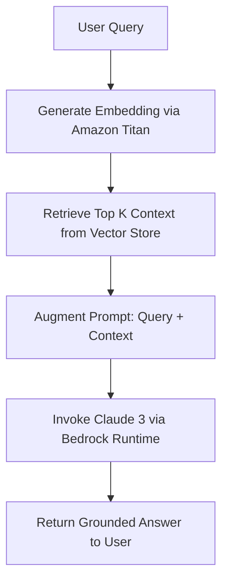

# AWS RAG Application Builder Skill

This skill guides the design, development, and deployment of a Retrieval-Augmented Generation (RAG) application utilizing AWS Bedrock, configured under the standard repository scaffold.

---

## 1. Scaffold Repository Structure

The RAG application is organized using the following file tree layout:

```text
├── data/                    # Local vector stores, documents, and reference text chunks
├── deployment/
│   └── docker/              # Dockerfiles, docker-compose.yml for containerized runs
├── scripts/                 # Administration scripts, database migrations, data ingest scripts
├── src/                     # Core application source code
│   ├── __init__.py
│   ├── main.py              # Application entrypoint (FastAPI / Streamlit / CLI)
│   ├── core/                # Configuration, logging, and security
│   ├── database/            # Vector DB client connections (OpenSearch, PGVector)
│   └── services/            # AWS Bedrock connectors, ingestion and retrieval logic
├── .env.template            # Reference environment file mapping AWS credentials & models
├── .gitignore               # git exclusions (prevents data, logs, and secrets commit)
├── .test_inspect            # Debugging config or inspection check indicators
├── README.md                # Developer onboarding guide
├── requirements.in          # High-level Python dependencies
├── requirements.txt         # Pinned/compiled installation dependencies
└── test_bedrock.py          # Quick-test script for verifying AWS Bedrock IAM & model access
```

---

## 2. Ingesting & Managing Dependencies

1. **High-Level Packages (`requirements.in`)**:
   Add direct third-party packages needed for RAG:
   ```text
   boto3                   # AWS SDK for Python
   langchain-aws           # AWS integration for LangChain
   fastapi                 # API layer
   uvicorn                 # ASGI server
   chromadb                # Local vector store (or pgvector/opensearch-py)
   python-dotenv           # Environment management
   ```

2. **Compiling Dependencies (`requirements.txt`)**:
   Always pin dependencies using a compiler (like `pip-compile` from `pip-tools`) or install via:
   ```bash
   pip install -r requirements.txt
   ```

---

## 3. Local Environment Setup (`.env.template`)

Provide clear instructions for developers to map their environment variables without exposing sensitive credentials:

```bash
# AWS Credentials and Region config
AWS_ACCESS_KEY_ID=your_access_key_here
AWS_SECRET_ACCESS_KEY=your_secret_key_here
AWS_SESSION_TOKEN=your_session_token_if_using_temp_credentials
AWS_DEFAULT_REGION=us-east-1

# Bedrock Model Configuration
BEDROCK_LLM_MODEL_ID=anthropic.claude-3-sonnet-20240229-v1:0
BEDROCK_EMBEDDING_MODEL_ID=amazon.titan-embed-text-v1

# Vector DB config
VECTOR_DB_PATH=./data/vector_store
```

---

## 4. Verifying AWS Bedrock Access (`test_bedrock.py`)

Before building the full RAG pipeline, use `test_bedrock.py` to verify AWS credentials and Bedrock runtime connectivity:

```python
# test_bedrock.py
import os
import boto3
import json
from dotenv import load_dotenv

load_dotenv()

def test_connection():
    print("Initializing Bedrock Runtime client...")
    try:
        # Initialise boto3 client for Bedrock Runtime
        client = boto3.client(
            service_name="bedrock-runtime",
            region_name=os.getenv("AWS_DEFAULT_REGION", "us-east-1")
        )
        
        # Simple invocation payload (Claude 3 / Titan)
        model_id = os.getenv("BEDROCK_LLM_MODEL_ID", "amazon.titan-text-express-v1")
        
        # Test invocation
        body = json.dumps({
            "inputText": "Hello Bedrock, are you online?",
            "textGenerationConfig": {
                "maxTokenCount": 20,
                "temperature": 0.5
            }
        })
        
        print(f"Invoking test model: {model_id}...")
        response = client.invoke_model(
            body=body,
            modelId=model_id,
            accept="application/json",
            contentType="application/json"
        )
        
        response_body = json.loads(response.get("body").read())
        print("Success! Response:")
        print(response_body.get("results")[0].get("outputText"))
        
    except Exception as e:
        print(f"Error connecting to Bedrock: {e}")

if __name__ == "__main__":
    test_connection()
```

---

## 5. RAG Integration Flow & Best Practices

When building the RAG pipeline in `src/services/rag.py`:



* **Grounding Check**: In `src/services/`, implement checks to ensure the LLM's response only references the retrieved context. If context is empty, fallback to a safe message rather than hallucinating.
* **Token Budget**: Track context size to avoid exceeding Claude/Titan token windows.
* **Clean Session State**: Ensure vector connections and boto3 sessions are closed correctly to avoid resource leaks.
