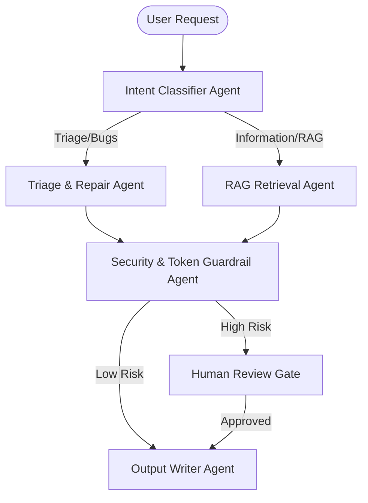

# Califisiques Enterprise AI Operations & Architecture Playbook


This playbook defines the architecture, security baselines, agentic orchestration, and operational workflows for building enterprise-grade, secure-by-design, and governance-ready AI systems at Califisiques. It adapts modern AI Ops playbooks to strict regulatory frameworks (NIST, HIPAA, CMMC) and grounds them in real-world production projects.

---

## 1. Core Mission & Philosophy

Every AI system designed and delivered by Califisiques operates under five fundamental architectural mandates:

1. **Security First**: All data access, tool execution, and prompt paths are restricted by default (Zero Trust, Least Privilege).
2. **Governance by Design**: Active Human-in-the-Loop (HITL) gates are mandatory for critical and regulated decision flows.
3. **Observability by Default**: Every agent decision, RAG query, and API call must be traceable and logged via OpenTelemetry.
4. **Source Grounding**: Generative outputs must be validated against a trusted source list. *No source = no claim.*
5. **Measurable Risk**: Prior to deployment, all models and data pipelines must be risk-classified and tested against prompt injections and regression.

---

## 2. The 4 Core Hubs (Califisiques Edition)

To prevent fragmented knowledge and fragmented agent execution, Califisiques establishes **four central databases** as the single source of truth (SSOT). All agents read from and write to these hubs.

```text
  [External Sources] → [Connectors] → ╔══════════════════════════════════════╗
                                      ║           THE FOUR CORE HUBS         ║
                                      ╠══════════════════════════════════════╣
                                      ║ 1. Tasks & Projects (AcuSurge / OTel)║
                                      ║ 2. CRM & Triage (ClaimSense / Brief) ║
                                      ║ 3. Notes & Brainstorms (CareIntel)   ║
                                      ║ 4. Company Knowledge (Guardrails)    ║
                                      ╚══════════════════════════════════════╝
```

### I. Tasks & Projects (Pipeline Orchestration)
*   **Purpose**: Tracks active pipeline runs, deployment tasks, and system status metrics.
*   **Reference Project**: **AcuSurge Clinical Data Pipeline** (Dagster/DuckDB-driven clinical data lake tracking patient and telemetry pipelines with automated validation logs).


### II. CRM & Triage (Action Items & Relationships)
*   **Purpose**: Logs incoming client requests, tickets, claims, and approval states.
*   **Reference Project**: **ClaimSense Agentic Triage** & **BlindLabs DevOps Agent Arcade** (Real-time FastAPI triage of incoming claims and bug tickets with interactive diagnostic status visualizers).


### III. Notes & Brainstorms (Research & Context)
*   **Purpose**: Captures meeting transcripts, research literature, clinical trials, and raw notes.
*   **Reference Project**: **CareIntel Brief** (Healthcare strategy RAG matching PubMed/ClinicalTrials.gov literature with verified FDA regulatory status).

### IV. Company Knowledge (Long-term Memory & Policies)
*   **Purpose**: Stores company policies, compliance templates, prompt guardrail rulebooks, and target security budgets.
*   **Reference Project**: **RAG Token Guardrails** (Redis-cached token-counting context controller sitting in front of RAG paths to maintain token budgets and prevent runaways).

---

## 3. The Connector Stack

Information flows automatically into the workspace hubs without manual copying and pasting.

| Connector | What Flows In | What It Unlocks | Reference Project |
| :--- | :--- | :--- | :--- |
| **Gmail / Outlook** | Email threads, claims, attachments | Inbox Triage, CRM updates, Auto-drafted replies | *ClaimSense Agentic Triage* |
| **Calendar** | Meeting invites, metadata | Contextual briefs, automated meeting transcripts | *CareIntel Brief* |
| **Slack / Teams** | Messages, informal decisions | Searchable team decisions, alert dispatches | *BlindLabs DevOps Arcade* |
| **GitHub / Jira** | Issues, PRs, codebase updates | CI/CD path scans, automated test reports | *Portfolio README* |
| **Dagster / Airflow** | Data pipeline execution states | Automated clinical & compliance audit trails | *AcuSurge Clinical Pipeline* |

---

## 4. The Custom Agent Workforce

Califisiques deploys specialized, bounded agents designed to execute complex tasks while maintaining safety constraints.



### I. The Triage & Diagnostic Agent
*   **Role**: Evaluates incoming tickets/claims, runs compliance checks, and routes to appropriate queues.
*   **Reference Architecture**: **BlindLabs DevOps Agent Arcade** (A-Star pathfinding agent scanning repository structures, isolating issues, and coordinating AST-level code patches).


### II. The Research & Synthesis Agent
*   **Role**: Performs concurrent external queries, extracts evidence, and summarizes findings.
*   **Reference Architecture**: **CareIntel Brief** (Coordinated subagents extracting literature rows, validating citations, and enforcing regulatory checks before declaring status "APPROVED").

### III. The Security & Token Guardrail Agent
*   **Role**: Evaluates prompt sizes, scans inputs for injection patterns, sanitizes PII/PHI, and tracks budget.
*   **Reference Architecture**: **RAG Token Guardrails** & **ClaimSense** (Context controller blocking over-budget queries and emitting OTel spans nested under structured trace keys).

---

## 5. 12-Phase NIST-Aligned Delivery Framework

Califisiques implements a strict 12-phase lifecycle for every AI project, aligning with **NIST AI RMF 1.0**, **NIST CSF 2.0**, and **MITRE ATLAS**:

```text
Phase 0: Intake & Problem Framing ──> Capture objective, stakeholder map, constraints
Phase 1: Risk & Compliance Classification ──> Tier 1 (Low) to Tier 4 (Safety-Impact/Critical)
Phase 2: Solution Architecture ──> Systems contexts, agent contracts, data flow mappings
Phase 3: Security Architecture ──> MFA, secrets rotation, input/output validation matrices
Phase 4: Data & RAG Architecture ──> Data sanitization, metadata filters, citation checks
Phase 5: Agentic Orchestration Design ──> Agent contracts, tool execution allowlists
Phase 6: Build & DevSecOps ──> Multi-agent coding, IaC templates, dependency scanning
Phase 7: Testing & Evaluation ──> Hallucination rates, injection resistance, regression tests
Phase 8: Observability & Monitoring ──> OpenTelemetry traces, latency, quality dashboards
Phase 9: Human-in-the-Loop Governance ──> Human gates for clinical, financial, or data export tasks
Phase 10: Deployment Readiness ──> Checklist gates: threat model complete, audit trails active
Phase 11: Handoff & Runbook Delivery ──> Separate Client and Engineering handoff packs
```

---

## 6. Build & DevSecOps Implementation

Califisiques enforces secure, modular APIs to build scalable agent services. The following implementation pattern demonstrates how we enforce input validation, rate limiting, and token budgets at the gateway level:


---

## 7. Observability & Monitoring Implementation

Observability is a mandatory gate. Every agent step, tool invocation, and token budget check emits OpenTelemetry spans to Arize AX or CloudWatch. 

This enables real-time trace analysis, confidence profiling, and drift detection:


---

## 8. The 3-Day Rollout Plan

To implement this compounding AI system for a new founder or enterprise team, execute the following 3-day roadmap:

### 📅 Day 1: Stand Up the Core Hubs
1. Provision the **4 Core Hubs** (Tasks, CRM, Notes, Wiki) in your collaborative workspace (e.g., Notion or PostgreSQL).
2. Migrate active project sheets and code repositories into the workspace.
3. Classify project risk (Phase 1) and define the security boundary (Phase 3).

### 📅 Day 2: Connect External Tools & Establish Guardrails
1. Configure connectors (Email, Calendar, Slack, GitHub) so information populates the hubs automatically.
2. Deploy **RAG Token Guardrails** and set maximum token limits per query to control costs.
3. Configure OpenTelemetry tracing to track API latency, cost, and trace timelines.

### 📅 Day 3: Deploy the Agent Workforce
1. Configure custom system prompt instructions and allowlists of tools for your agents.
2. Implement **Human-in-the-Loop (HITL)** approval gates for any action that exposes customer data or alters database records.
3. Run the automated test suites, verify citation accuracy, and open the live dashboard.

---

## 9. Reusable Playbook Templates

To initialize a new project under this playbook, reference the following templates:

### Template A: Agent Contract Definition
```json
{
  "agent_name": "string",
  "role": "string",
  "input": "string",
  "allowed_tools": [],
  "forbidden_tools": [],
  "decision": "string",
  "confidence": "low | medium | high",
  "sources": [],
  "risk_flags": [],
  "requires_human_review": true
}
```

### Template B: Human-in-the-Loop Approval Record
```json
{
  "decision_id": "string",
  "reviewer": "string",
  "decision": "approved | rejected | revise",
  "reason": "string",
  "risk_level": "low | medium | high | critical",
  "timestamp": "string"
}
```
