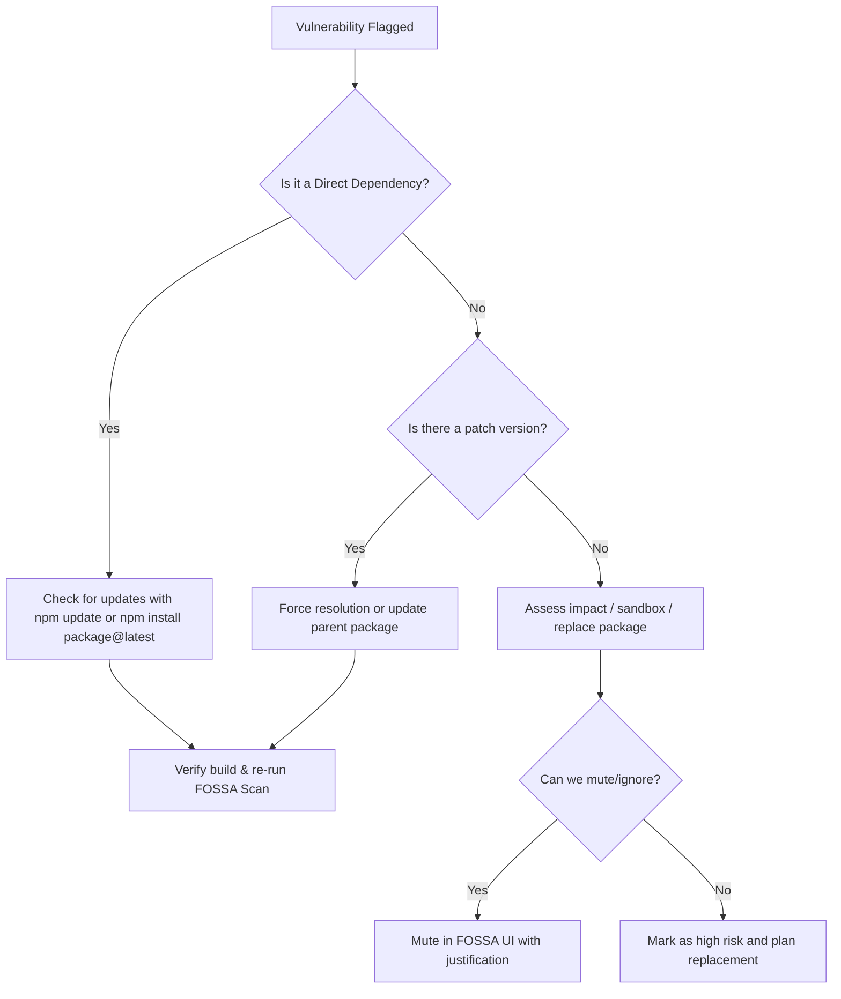

# FOSSA Security & Compliance Playbook

This playbook defines operational procedures for managing open-source security, license compliance, SBOM generation/imports, and custom scanning workflows with FOSSA.

---

## 1. Vulnerability Triaging & Remediation

When FOSSA detects CVEs (Common Vulnerabilities and Exposures) in your project, follow this triage flow:



### Operational Commands
1. **Identify Vulnerabilities locally**:
   ```bash
   fossa test --vulnerabilities
   ```
2. **Remediate Direct Dependencies**:
   Check if the vulnerability is fixed in a newer version of the direct dependency:
   ```bash
   npm update <package-name>
   ```
3. **Remediate Transitive Dependencies**:
   If the vulnerability is in a deep child dependency, use `overrides` in `package.json` to force a secure version:
   ```json
   "overrides": {
     "vulnerable-package": "^1.2.3"
   }
   ```
   Then run `npm install` and re-run FOSSA.

---

## 2. License Compliance & Policy Enforcement

FOSSA helps ensure that your code does not violate open-source licensing models (e.g., preventing copyleft licenses like GPL/AGPL in proprietary applications).

### License Triaging Rules
1. **Standard Allowlist**: MIT, Apache-2.0, BSD-3-Clause, ISC. These are auto-approved.
2. **Flagged Licenses**: LGPL, MPL. Requires approval from the team/legal to ensure they are used as dynamic libraries or unmodified.
3. **Denied Licenses**: AGPL, GPL. If flagged, you must find an alternative package or obtain a commercial license.

### Resolving a License Issue in the UI
* **Ignore/Resolve**: If a package is dual-licensed (e.g., licensed under both GPL and MIT), select the **MIT** option in the FOSSA Web Dashboard.
* **Add Custom License**: For private packages or custom commercial licenses, upload the license file to the FOSSA project settings to resolve "Unknown License" flags.

---

## 3. SBOM (Software Bill of Materials) Operations

### Generating/Exporting an SBOM
You can generate SBOMs in formats such as SPDX or CycloneDX.

* **Via FOSSA CLI**:
  ```bash
  # Generate an SPDX report in JSON format
  fossa report spdx > sbom-spdx.json

  # Generate a CSV of all licenses and dependencies
  fossa report licenses > licenses-report.csv
  ```
* **Via FOSSA Web UI**:
  1. Navigate to your project on the FOSSA Dashboard.
  2. Click **Reports** -> **Generate Report**.
  3. Choose **SPDX (JSON/Tag-Value)** or **CycloneDX (XML/JSON)**.
  4. Download and store in your release artifacts.

### Importing a Third-Party SBOM
To analyze a pre-built package or a vendor's product:
1. Log in to the FOSSA Web Console.
2. Go to **Projects** -> **Add Project** -> **Upload SBOM**.
3. Upload the SBOM file (`CycloneDX` or `SPDX`).
4. FOSSA will parse the file, catalog all sub-dependencies, and run license and vulnerability analysis on them.

---

## 4. Snippet Scanning & Copy-Paste Auditing

Snippet scanning matches your codebase source files (e.g. under `src/`) against known open-source repositories to detect unlicensed copy-pasting.

1. Ensure snippet scanning is enabled in `.fossa.yml`:
   ```yaml
   snippets:
     enabled: true
     paths:
       - src/
   ```
2. **Reviewing Snippet Alerts**:
   * Snippet alerts do not break the CLI build by default; they appear in the FOSSA Dashboard under the **Snippets** tab.
   * **Action**: If a snippet matches an open-source library, verify if the code was copied. If yes:
     * Add the appropriate copyright notice/attribution.
     * Replace the snippet with an official dependency if possible.
     * If it is a common algorithm/false positive, mark it as **Ignored** in the FOSSA dashboard.

---

## 5. Scanning Vendored Dependencies

If you check libraries or pre-compiled binaries directly into git (e.g., in a `legacy/` or `vendor/` directory):

1. **Configure raw targets** in `.fossa.yml`:
   ```yaml
   targets:
     - name: creative-science-vendored
       type: raw
       path: legacy
       options:
         scan-vendored: true
   ```
2. **How FOSSA Scans Them**:
   * The FOSSA CLI will walk the directory, look for license files, headers, or manifest files, and match them against known vendor releases.
   * Make sure that you include the original `LICENSE` or `README` files for vendored dependencies inside their directories to ensure FOSSA detects them accurately.

---

## 6. AI-Generated Code Audit & IP Safeguards

To prevent ownership conflicts, copyleft contamination, or corporate data leakage when building with AI assistants like Antigravity, apply the following guardrails:

### A. Documenting Human authorship (HITL)
To secure copyright protection:
1. **Design Decisions**: Humans must define the codebase structure, database design, and key architectural choices.
2. **Pull Request Reviews**: Human developers must review and approve all agent PRs before merging.
3. **Core Development**: Humans must write or heavily modify core algorithms and business logic.
4. **Action**: Document development workflows in commit messages and PR logs, specifying human direction and verification.

### B. Handling AI Code Replication & Copyleft Triggers
1. FOSSA Snippet Scanning serves as our primary defense. It will flag copy-paste signatures of code identical to GPL/AGPL libraries.
2. **Action Item**: When FOSSA flags a snippet:
   * Trace the generated function or component back to the prompt context.
   * If it is a direct replication of copyleft-licensed source, **rewrite the logic**. Introduce custom TypeScript types, rename functions, or use helper functions to make the implementation distinct.
   * If it is a standard helper method (e.g., array sort, math formulas), document the common usage and ignore in FOSSA.

### C. Preventing Data Leakage
1. **Secret Scanning**: Ensure no API keys or service account credentials are added to the prompt contexts. Set up `.gitignore` to prevent committing secrets:
   ```bash
   # Add to .gitignore
   .env
   *.pem
   *creds.json
   ```
2. **Model Training Controls**:
   * Ensure that you use Vertex AI Enterprise / Google Cloud APIs under enterprise contracts where data isolation is guaranteed.
   * Verify that your workspace settings block model training on interaction history.

---

## 7. The Legal Landscape of AI-Generated Code

When building with Antigravity, the key IP risks fall into three categories:

### A. Ownership of the Generated Code (Who owns it?)
* **Google's Terms**: Under Google Cloud/Vertex AI enterprise policies, you retain all ownership rights to the prompts (inputs) and the generated code (outputs). Google does not claim IP ownership over what the agent writes.
* **Copyright Offices (Authorship)**: Copyright laws globally (e.g., the US Copyright Office) state that purely AI-generated work without human intervention cannot be copyrighted.
* **How you address it**: Because you operate as a Human-in-the-Loop (HITL) programmer—defining the architecture, writing core React components, reviewing pull requests, and debugging—the final product represents a combined work of human authorship, which is legally protectable under copyright.

### B. Copyleft Licensing & Code Replication Risk (Did the AI copy someone else?)
* **The Risk**: AI models are trained on public code. There is a small probability that the agent might generate a block of code that is substantially identical to an open-source library governed by a copyleft license (like GPL or AGPL). If merged into a proprietary product, this could legally force the company to open-source their codebase.
* **How you address it**: Implement automated license-scanning and compliance guardrails in the CI/CD pipeline (e.g., using FOSSA, Snyk, or Black Duck). These tools scan all committed dependencies and code signatures for GPL/AGPL copyleft code before deployment.

### C. Data Leakage (Is your proprietary code training public models?)
* **The Risk**: Uploading proprietary codebases, database schemas, or API keys into the LLM context might expose corporate secrets or feed them into public training datasets.
* **How you address it**: In your global and project settings (`settings.json`), ensure your workspace is configured to block model training on interactions. Under Google's enterprise terms, enterprise account data is strictly isolated and never used to train Google’s public foundation models.

