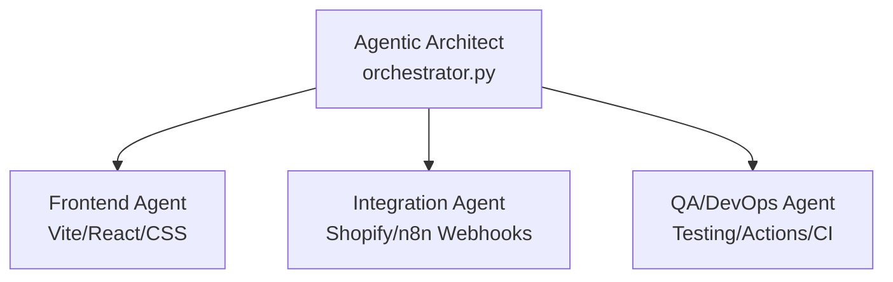
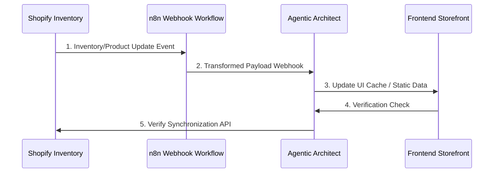

# Multi-Agent Stack Architecture

This document describes the multi-agent system designed to orchestrate the redesign and re-engineering of the **Afrophysiques** e-commerce application. The stack comprises specialized agent roles managed by a central Agentic Architect.

---

## 1. Stack Roles and Responsibilities

Our multi-agent hierarchy splits responsibility across four distinct dimensions to prevent overlap and ensure structural integrity:



### A. Agentic Architect (Parent Agent)
* **Role**: Orchestrates tasks, coordinates state, and delegates files to specific subagents.
* **Responsibilities**:
  * Initializes the `google-antigravity` environment.
  * Configures global policies, workspace bounds, and budget limits.
  * Audits tool calls and maintains the overall execution log.

### B. Frontend Agent (Subagent)
* **Role**: Builds the ultra-modern, reactive interface.
* **Responsibilities**:
  * Develops responsive React/Vite layout, typography, components, and state management.
  * Connects storefront UI inputs with Shopify Storefront API endpoints.
  * Implements accessibility standards (a11y) and Core Web Vitals (LCP, INP) enhancements.

### C. Shopify Integration Agent (Subagent)
* **Role**: Connects backend services, inventory management, and event-driven architectures.
* **Responsibilities**:
  * Maps Shopify inventory to reactive frontend data stores.
  * Manages real-time data flows by implementing webhook retrieving endpoints via n8n.
  * Implements order synchronization and cart checkout persistence.

### D. QA & DevOps Agent (Subagent)
* **Role**: Verifies stability, runs static analysis, and manages deployments.
* **Responsibilities**:
  * Runs unit and integration tests (e.g. Playwright or Jest).
  * Audits security policies and scans for leaked credentials or secrets.
  * Configures GitHub Actions pipelines and checks deployment builds.

---

## 2. Guardrails & Safety Policies

To prevent agents from executing destructive commands, leaking data, or editing files outside the scope of the project, we enforce strict SDK-level policies:

### Workspace Isolation
The system enforces workspace boundaries. All file operations (`view_file`, `create_file`, `edit_file`) are strictly isolated to:
`[Workspace Path](file:///Users/lynuelx/Documents/creative%20science/)`

In code, this is implemented using `policy.workspace_only`:
```python
from google.antigravity.hooks import policy

workspace_policy = policy.workspace_only(["/Users/lynuelx/Documents/creative science"])
```

### Shell Command Controls
* Standard shell execution is **denied by default** unless explicit human-in-the-loop approval is obtained.
* Custom argument filtering blocks critical system commands (e.g., denying `rm -rf`, `chmod`, etc.):
```python
policy.deny("run_command", when=lambda args: "rm" in args.get("CommandLine", ""))
```

---

## 3. Communication and Event Flow (Triad Model)

The diagram below outlines how the user, the agent stack, Shopify, and n8n webhooks communicate:



1. **Shopify** emits product or inventory updates via webhooks.
2. The event is captured and normalized by the **n8n Webhook Workflow**.
3. **n8n** triggers the **Agentic Architect** update endpoint.
4. The Agent applies the change and coordinates with the **Frontend** to refresh state.
5. The synchronization is verified, and logs are recorded in the audit trail.
