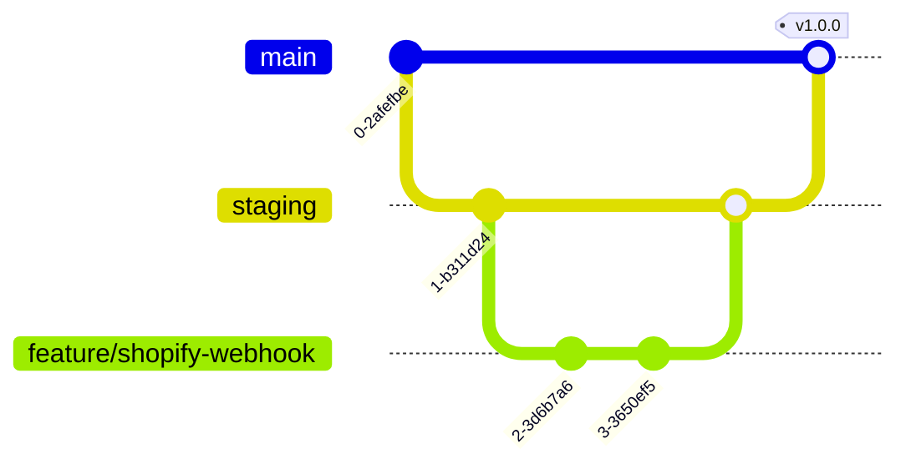

# Deployment & Testing Playbook

This document describes the testing, build validation, and deployment pipeline for the Afrophysiques e-commerce transformation.

---

## 1. Branching & Git Workflow

We use a Git-Flow-inspired branching strategy to ensure stable deployments.

* **`main`**: Production-ready code. Auto-deploys to our hosting server.
* **`staging`**: Pre-release testing branch. Receives webhooks from Shopify testing stores.
* **`feature/*`**: Development branches. Merges to staging require passing tests and linting.



---

## 2. Automated Testing Suite

To maintain high confidence, all changes go through three levels of validation:

### A. Static Analysis & Linting
* **Python**: Enforce type checking with `mypy` and formatting with `black`.
* **Frontend**: Run `eslint` and `prettier` to keep code clean and uniform.

### B. Integration Tests
* **Webhook Mocking**: Local unit tests simulate Shopify payloads reaching our webhook receivers to verify payload transformation.
* **API Mocking**: Mock Shopify Storefront API GraphQL responses to ensure the frontend doesn't crash during network failures.

### C. End-to-End Testing (E2E)
* **Playwright**: Simulates user actions: opening the homepage, clicking a product, adding it to the cart, and verifying redirect to the Shopify checkout domain.

---

## 3. GitHub Actions CI/CD Pipeline

On every Pull Request to `main` or `staging`, the following pipeline runs automatically:

```yaml
name: Test and Build Validation

on:
  push:
    branches: [ main, staging ]
  pull_request:
    branches: [ main, staging ]

jobs:
  validate:
    runs-on: ubuntu-latest
    steps:
      - name: Checkout Code
        uses: actions/checkout@v4

      - name: Setup Python
        uses: actions/setup-python@v5
        with:
          python-version: '3.10'

      - name: Install Python Dependencies
        run: |
          pip install black mypy pytest

      - name: Validate Python Code
        run: |
          black --check src/
          mypy src/
          pytest tests/

      - name: Setup Node.js
        uses: actions/setup-node@v4
        with:
          node-version: '20'

      - name: Install Frontend Dependencies
        run: npm ci

      - name: Build Frontend Application
        run: npm run build
```

---

## 4. Claude Code / Antigravity CLI Integration

Developers can trigger validations and orchestrate features locally using Claude Code or the Antigravity CLI:
* **Verify Code Style**: Run `agy check` or `claude check` (standard linter hooks).
* **Test Local webhooks**: Run mock payloads against local servers using `curl` or automated python scripts.
* **Trigger Deployments**: Auto-deployment is handled via Webhook hooks on git push to deployment branches.
