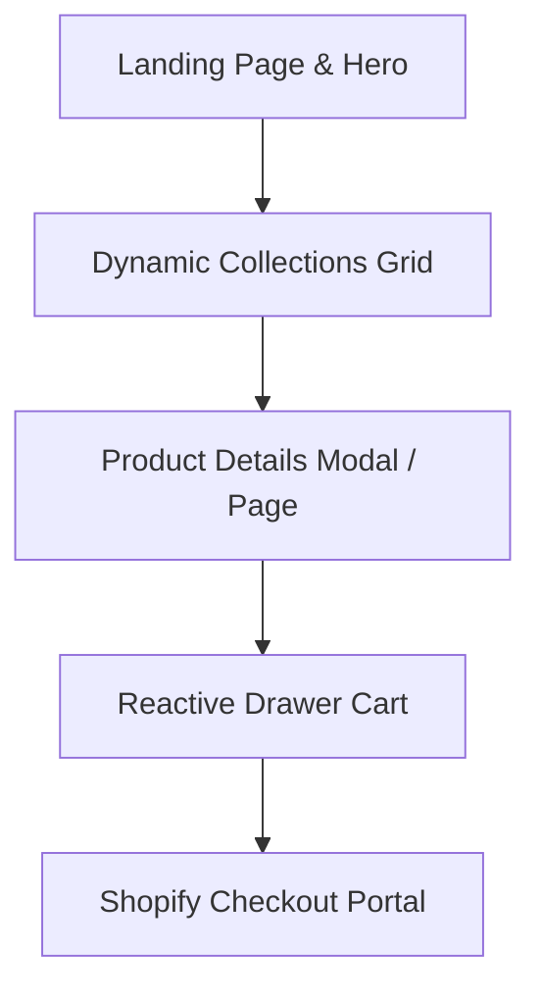

# Frontend Roadmap - Afrophysiques Redesign

This document outlines the frontend roadmap, design system requirements, and API connections required to transform **Afrophysiques** into an ultra-modern, reactive, responsive e-commerce experience.

---

## 1. Design System & Aesthetics

The redesigned Afrophysiques interface must feel premium, state-of-the-art, and responsive.

### Visual Architecture
* **Typography**: Outfit (headings) and Inter (body) imported from Google Fonts. Avoid system defaults.
* **Color Palette**: Curated dark theme. High contrast and accessibility (WCAG AA compliant contrast ratios):
  * **Background**: Deep Onyx (`#0A0A0A` to `#121212`)
  * **Primary Accent**: Vibrant Amber Gold (`#D4AF37`) for CTAs and highlighted elements.
  * **Secondary Accent**: Teal Green (`#0D9488`) for inventory tags and checkout pathways.
* **Glassmorphism**: Sticky navigation bars and modal overlays using `backdrop-filter: blur(12px) saturate(180%)` combined with subtle semi-transparent borders.
* **Transitions**: Smooth micro-animations on hovers, scale transitions for product cards (e.g., `transition: transform 0.3s cubic-bezier(0.25, 0.46, 0.45, 0.94)`).

---

## 2. Component Structure

The app will be structured as a Single Page Application (Vite + React) with the following views:



### Key Components
1. **Hero Section**: High-resolution imagery of fitness apparel with bold, fluid typography overlays.
2. **Infinite Product Feed**: Grid showing products with real-time stock alerts pulled from n8n synced caches.
3. **Reactive Slide-out Cart**: Slide-out cart displaying added items instantly without page reload. Calculates total price dynamically.
4. **Interactive Filters**: Slide-out filtering panel by size, color, collection, and price.

---

## 3. Shopify Storefront API Integration

To query products and build cart checkout links dynamically on the clientside, the frontend interacts directly with Shopify's GraphQL Storefront API.

### GraphQL Query Example: Get Products
```graphql
query getProducts {
  products(first: 20) {
    edges {
      node {
        id
        title
        handle
        descriptionHtml
        images(first: 1) {
          edges {
            node {
              url
              altText
            }
          }
        }
        variants(first: 5) {
          edges {
            node {
              id
              title
              price {
                amount
                currencyCode
              }
              quantityAvailable
            }
          }
        }
      }
    }
  }
}
```

### GraphQL Mutation: Create Checkout
```graphql
mutation createCheckout($input: CheckoutCreateInput!) {
  checkoutCreate(input: $input) {
    checkout {
      id
      webUrl
    }
    checkoutUserErrors {
      message
      field
    }
  }
}
```
* The generated `webUrl` redirects the client securely to Shopify's hosted payment processor, preserving cart state.
