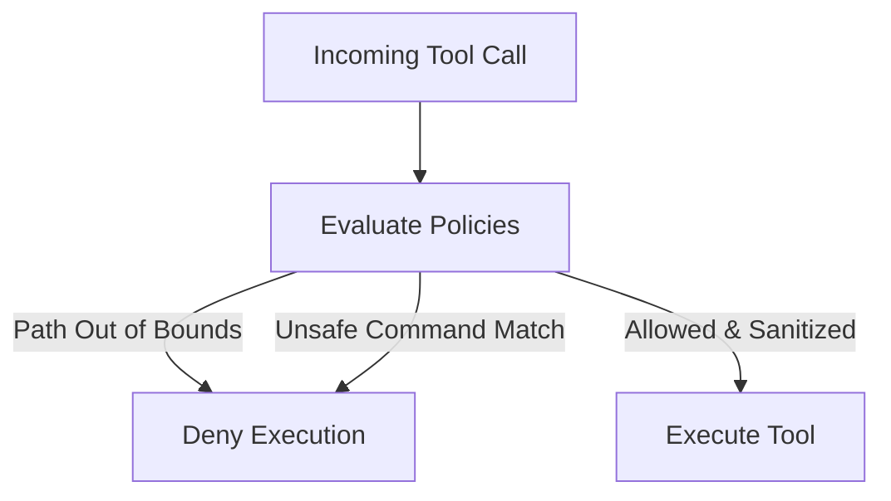

# Observability & Security Playbook

This document details the security practices, guardrails, and observability tools implemented in the Afrophysiques multi-agent stack.

---

## 1. Observability and Monitoring

Observability is crucial when executing autonomous agent turns to monitor billing cost, handle token explosion, and trace anomalies.

### Token Cost Tracking
Every agent turn utilizes tokens. To prevent runaway costs (especially when models run in loops or use extended thinking), the orchestrator tracks usage dynamically.
* **Telemetry**: Reads `agent.conversation.total_usage` property after each cycle.
* **Metrics Tracked**: Prompt tokens, Candidate (completion) tokens, and Thinking tokens.
* **Guardrails**: An absolute cap of 50,000 total tokens per session is enforced.

### Structured Logging
All steps and tool calls are logged via the standard python `logging` package under the namespace `google.antigravity`.
* **Log Level**: Set to `INFO` for production, `DEBUG` for debugging.
* **Audit Trail**: Every tool execution registers in a local `/Users/lynuelx/Documents/creative science/logs/audit.log` file using `post_tool_call` hooks.

---

## 2. Guardrails & Agent Access Controls

We configure the SDK agent with restrictive access policies to minimize the blast radius of any autonomous actions:

### Workspace confinement
The agent's workspace is locked using `policy.workspace_only`. Attempting to read or modify files outside `/Users/lynuelx/Documents/creative science/` results in an immediate security denial.

### Command Execution Filters
Shell command executions are highly audited. We restrict execution by implementing:
* Hard blocking on shell modifications like `chmod`, `rm -rf`, or network calls (`curl`, `wget`).
* Sandboxing commands inside a local terminal environment.

---

## 3. Cybersecurity & Data Protection

Protecting customer transactions, client credentials, and store configurations is our highest priority.

### Secret Management
* **Zero Hardcoding**: All authentication tokens (Shopify API, Google Gemini API, Webhook secrets) are stored in an uncommitted `.env` file.
* **Secret Masking**: The orchestrator's logging handler automatically filters out values matching keys in the `.env` file to prevent token leakage in stack traces.

### Webhook payload Sanitization
To prevent Injection attacks through Shopify webhook routes:
1. **Signature Verification**: Every payload must match the HMAC SHA256 signature generated using `N8N_WEBHOOK_SECRET`.
2. **Schema Enforcement**: Inputs must strictly conform to expected types (e.g. validating numeric IDs, converting inputs to strictly formatted strings).
3. **Rate Limiting**: The webhook receiver rejects requests exceeding 100 requests per minute from a single source.
