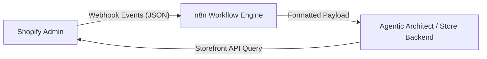

# Shopify & n8n Webhook Integration

This document outlines the real-time event synchronization and data flows between Shopify, the n8n automation engine, and the Afrophysiques e-commerce backend.

---

## 1. Integration Topology

The synchronization triad guarantees that inventory, order, and checkout states remain consistent in real-time.



* **Shopify Admin Events**: Dispatches webhooks on events like `products/update`, `inventory_levels/update`, and `orders/create`.
* **n8n Workflow Engine**: Serves as the webhook receiver, decrypts signature headers, transforms Shopify's complex payloads into simplified formats, and triggers updates in the application.
* **Storefront API**: The frontend queries Shopify directly for checkout creation and product page delivery, ensuring zero lag.

---

## 2. Webhook Schema & payload Examples

### Product Update Payload (Shopify -> n8n)
Shopify posts a JSON payload to the n8n endpoint. Below is an example payload representing an inventory update:

```json
{
  "id": 7880321196274,
  "title": "Afrophysiques Signature Hoodie",
  "handle": "afrophysiques-signature-hoodie",
  "variants": [
    {
      "id": 43567781298418,
      "title": "Medium / Onyx Black",
      "sku": "AP-HD-BLK-M",
      "price": "125.00",
      "inventory_quantity": 42
    }
  ],
  "updated_at": "2026-07-06T05:22:00-07:00"
}
```

### Transformed Webhook Payload (n8n -> Agent Backend)
n8n normalizes the data to reduce overhead:

```json
{
  "event": "inventory.sync",
  "timestamp": 1783350120,
  "sku": "AP-HD-BLK-M",
  "shopify_variant_id": 43567781298418,
  "new_stock": 42,
  "signature": "sha256_hash_value"
}
```

---

## 3. n8n Workflow Design Nodes

A standard n8n workflow for this system includes:

1. **Webhook Node**: Receives incoming Shopify webhook. Enforces HTTP POST and extracts `X-Shopify-Hmac-SHA256` header.
2. **Crypto / Code Node**: Validates the payload signature using the Shopify webhook client secret.
3. **Set Node**: Flattens parameters to map directly to the database or frontend cache schemas.
4. **HTTP Request Node**: Forwards the update payload to the backend server or the agent orchestrator webhook router.

---

## 4. API Credentials & Authentication

To set up the integration, the following credentials must be configured securely (see [observability_and_security.md](file:///Users/lynuelx/Documents/creative%20science/docs/observability_and_security.md) for keys management):

| Key Name | Target System | Scope | Description |
|---|---|---|---|
| `SHOPIFY_STOREFRONT_TOKEN` | Storefront API | Read products, collections, checkout | Placed on the frontend client to query products |
| `SHOPIFY_ADMIN_API_SECRET` | Admin API | Read/Write inventory and webhooks | Placed in the n8n workspace to verify webhooks |
| `N8N_WEBHOOK_SECRET` | n8n / Backend | Webhook Signature validation | Shared secret to authenticate messages from n8n to backend |
